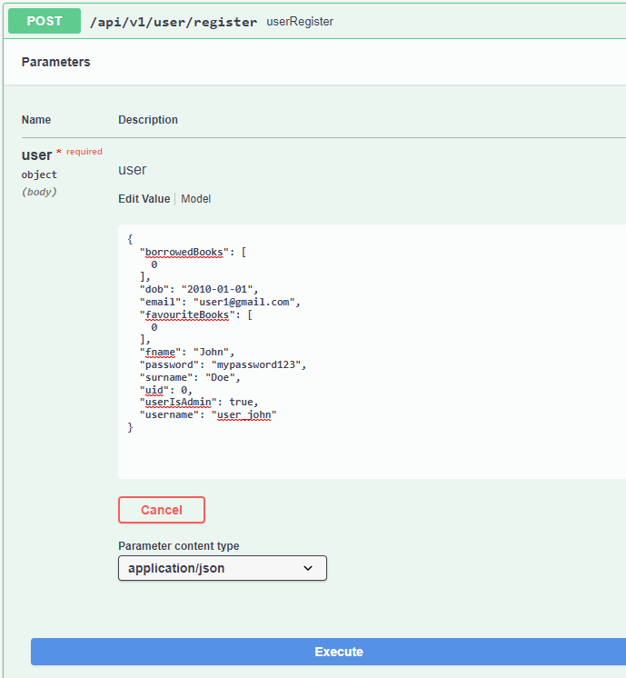
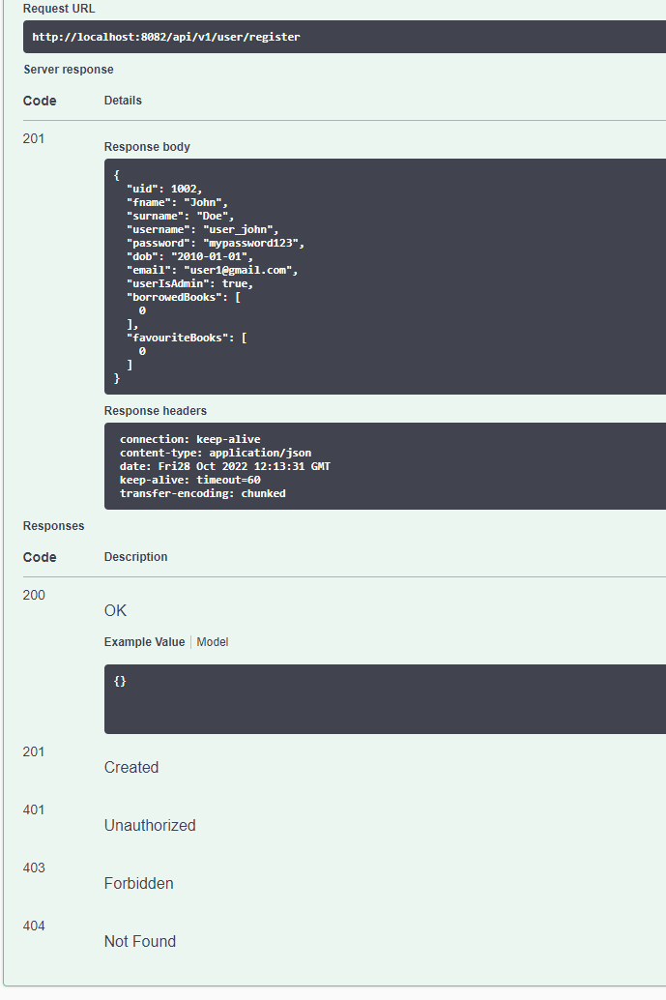

# Library Management System
<p>Library Management System, is an application that is used to manage a library, </p>
<p>it can allow users to create and manage user profiles including personal details such as names, </p>
<p>login credentials, date of birth, email, list of favourited books and currently checked out books. </p>
<p>It can also manage a catalogue of books with many details such as author, description, genre, availability etc. </p> 
<p>The data are stored in a SQL database.</p>
<p>Book Issue Orders can also be generated and can be used to keep track of which users have checked out which books.
</p>
<br>
<hr>
Features include:<br>
* API Integration
* MySQL Backend
* Manage Users
* Manage Catalogue
* Manage Issues


###Problem Statement
Create an application using Spring with the following components:
- Managed User Repository
- Managed Book Repository
- Managed Book Issues Repository
- Using Industry Standard Architecture Layers

###Tech Stack

- JDK 17
- Maven 3.8.6
- MySql 8.0
- Spring Boot 2.7.5

### Instructions

1. downalod and locate library-management-system.jar file
2. open cmd and check that the path is set to the same destination as the aforementioned .jar file
3. enter the following command :

```
java -jar library-management-system.jar
```
application will initiate, refer to the api documentation below for help on using the application


### API Endpoints
Swagger url end point documentation: 

```
http://localhost:8082/swagger-ui/index.html 
```

### Demo - register a user
<p>create a json containing the relevant key value properties</p>



<p>if the json contains valid values, you get a valid response </p>


<br>
<br>
<br>

### API End Points


 

<hr>

